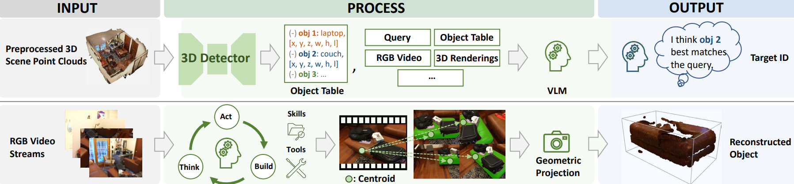

Think, Act, Build: An Agentic Framework with Vision Language Models for Zero-Shot 3D Visual Grounding

<div align="center">
  
</div><br/>

## 🛠️ Install
1. Clone this repository and navigate to folder
```bash
git clone https://github.com/WHB139426/TAB-Agent.git
cd TAB-Agent
```

2. Install Package
```Shell
conda create -n tab python=3.12.13
conda activate tab
pip install -r requirements.txt
pip install flash-attn==2.7.3 --no-build-isolation 
# if flash-attn is not avaliable, modify the attn_implementation in agent/client.py from "flash_attention_2" to "eager"
# or run: pip install https://github.com/Dao-AILab/flash-attention/releases/download/v2.7.3/flash_attn-2.7.3+cu12torch2.4cxx11abiFALSE-cp312-cp312-linux_x86_64.whl
```

## 🤗 Prepare the Pretrained Weights
Set your own `weight_path` to storage the pretrained weights. The folder should be organized as follows: 
```
├── TAB-Agent
│   └── agent
│   └── main.py
│   └── ...
├── weight_path
│   └── Qwen3-VL-32B-Instruct
│   └── sam3
```
Download the pretrained weights [[🤗Qwen3-VL-32B-Instruct](https://huggingface.co/Qwen/Qwen3-VL-32B-Instruct)] and [[🤗SAM3](https://huggingface.co/facebook/sam3)] in your own `weight_path`. 

## 🚀 Qucik Start
We give a brief example to run the example code. We recommend a single GPU with 80GB memeroy for Qwen3-VL-32B-Instruct inference.
1. replace the parameter `client_id` in `main.py` with your `Qwen3-VL-32B-Instruct` weight path.
2. replace the parameter `sam_path` in `main.py` with your `SAM3` weight path.
3. run the command:
```Shell
python main.py
```
4. you can observe the execution trace in `tab_workspace/chat_history.json`

## 🎬 Prepare the Dataset
We provide the [ScanRef](https://github.com/daveredrum/ScanRefer) and [Nr3D](https://github.com/referit3d/referit3d) datasets, along with our refined annotations, on Hugging Face: [WHB139426/Scannet](https://huggingface.co/datasets/WHB139426/Scannet). Please download the required files and extract `scannet-dataset.zip` and `scannet-frames.zip` into your designated `data_path`. After downloading and unzipping, your workspace should be organized as follows:
```text
├── TAB-Agent/                            
│   ├── agent/
│   ├── main.py
│   └── ...
├── weight_path/                          
│   ├── Qwen3-VL-32B-Instruct/
│   └── sam3/
└── data_path/                            
    ├── referit3d/
    │   └── nr3d_val_250_refined.json
    ├── scanref/
    │   └── scanref_val_250_refined.json
    ├── scannet-dataset/                  # Unzipped from scannet-dataset.zip
    │   ├── scene0000_00/
    │   │   ├── scene0000_00_vh_clean_2.ply
    │   │   ├── scene0000_00_vh_clean_2.labels.ply
    │   │   ├── scene0000_00_vh_clean_2.0.010000.segs.json
    │   │   ├── scene0000_00.aggregation.json
    │   │   └── scene0000_00.txt
    │   ├── scene0000_01/
    │   └── ...
    └── scannet-frames/                   # Unzipped from scannet-frames.zip
        ├── scene0000_00/
        │   ├── 00000.jpg
        │   ├── 00000.png 
        │   ├── 00000.txt
        │   └── ...
        ├── scene0000_01/
        └── ...
```

## 💡 Evaluation
To evaluate the model on the validation sets, please follow these steps:
1. Open `scripts/eval.sh` and modify `CLIENT_ID` and `SAM_CKPT` to point to the local paths where you saved your model weights.
2. In the same script (`scripts/eval.sh`), change the `DATA_DIR` variable to match your designated `data_path`.
3. Execute the evaluation script. You can easily control the number of GPUs used for parallel inference by modifying `NUM_GPUS` and `CUDA_VISIBLE_DEVICES` within the script.
```bash
bash scripts/eval.sh
```
4. Once the inference is complete, run the corresponding Python script to calculate the final metrics for your target dataset:
```bash
# For ScanRef results
python result_scanref.py

# For Nr3D results 
# Replace the DATA_DIR in `result_nr3d.py` with your own `data_path` before running
python result_nr3d.py
```

## ✏️ Citation
If you find our paper and code useful in your research, please consider giving a star :star: and citation :pencil:.

```BibTeX


```
